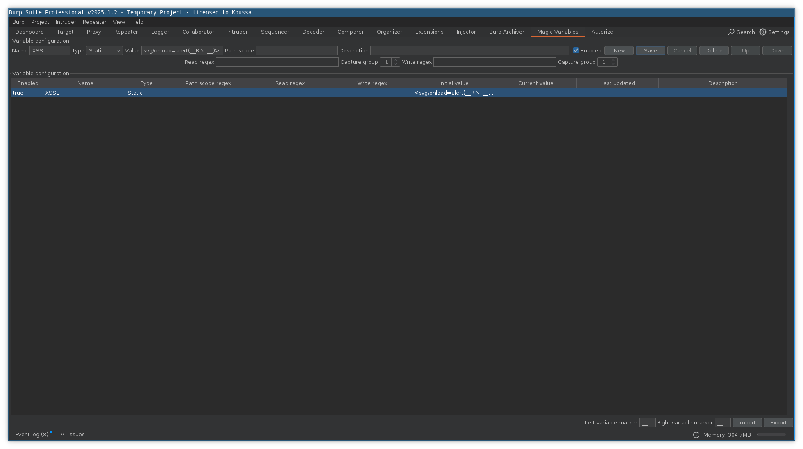

# 🪄 Magic Variables
Magic variables is a Burp extension that provides helpful replacements in traffic such as random integers, random UUIDs
and random strings. This allows pentesters to easily correlate sinks with their sources. The use of built-in variables
such as `__NEUUID__` and `__NERINT__` is also particularly useful for dynamic scans where a request may require a unique
value for every request. The Magic Variables extension supports 3 types of variables - static, dynamic and built-in.

## Static variables:
User defined variables that are simple substitutions. For example `__SIMPLE_XSS__` could be mapped to ``

## Dynamic variables:
User defined variables that can be used to read values and place them elsewhere. Useful for session management scripts that require path parameters.

## Built in variables:
Built in variables are pre-defined variables that perform common actions such as returning a random number or inserting
a collaborator address.

- `__RINT__` - A random 8 digit integer
- `__NERINT__` - A random integer that will be updated on every request
- `__UUID__` - A random UUID
- `__NEUUID__` - Any UUID containing `DE-ADBE-EF` will be updated
- `__RANDSTR__` - A random string of 8 characters
- `__NENDSTR__` - A random string of 8 characters that will be updated on every request
- `__TIMESTAMP__` - A unix timestamp
- `__OOB__` - A collaborator payload
- `__FNAME__` - A random first name
- `__LNAME__` - A random last name
- `__LOREMIPSUM__` - A random latin word
- `__LOREMIPSUMSENTENCE__` - A random latin sentence
- `__REPEATSTR__STR__COUNT__` - A repeated string where `STR` is repeated `COUNT` times
- `__XSS__` - A standard XSS payload ( with `RINT` )
- `__XSSPG__` - A polyglot XSS payload ( with `RINT` )
- `__SSTI__` - The standard SSTI polyglot
- `__XXE__` - An XXE payload ( with `OOB` )
- `__HTMLOOB__` - An HTML injection test ( with `OOB` )
- `__JSOOB__` - A JavaScript injection test ( with `OOB` )

### Example usage:
- Use a dynamic variable to read a value from a response with `sessionid='([^']+)'` and write it to a request 
with `/session/([a-f0-9]+)/profile`
- Include a collaborator payload quickly by using the built-in variable `__OOB__`
- Create a static variable to called XSS1 with the value `<svg/onload=alert(__RINT__)>`. When you include `__XSS1__` in
a request it will be automatically replaced with `<svg/onload=alert(26695343)>`

**Note:**
- "NE" means never ending. For variables such as `__NEUUID__` and `__NERINT__` a new value will be generated each time.
- Variables are marked by the variable marker `__`, this can be configured within the extension if it conflicts with the
application you're testing
- Magic variables will only operate on requests that are in scope

# FAQ
#### Q: Why are replacements not happening?
A: Check the enabled sources at the bottom of the UI and make sure the source in question is enabled

#### Q: Why aren't I seeing the replacements in my proxy history?
A: Select a request and click "Edited request"

#### Q: I sent a request using the repeater but nothing changed?
A: Check the Logging tab

#### Q: The `__` sequence conflicts with syntax used in the target I'm testing, how can I fix this?
A: Change the left and right variable markers in the bottom left of the UI

# User interface

The main user interface is loaded into a tab

